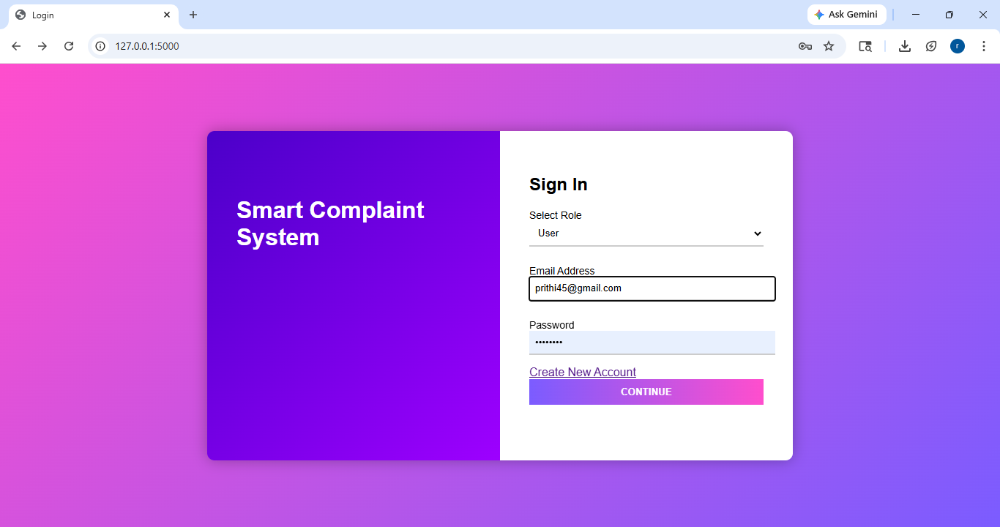
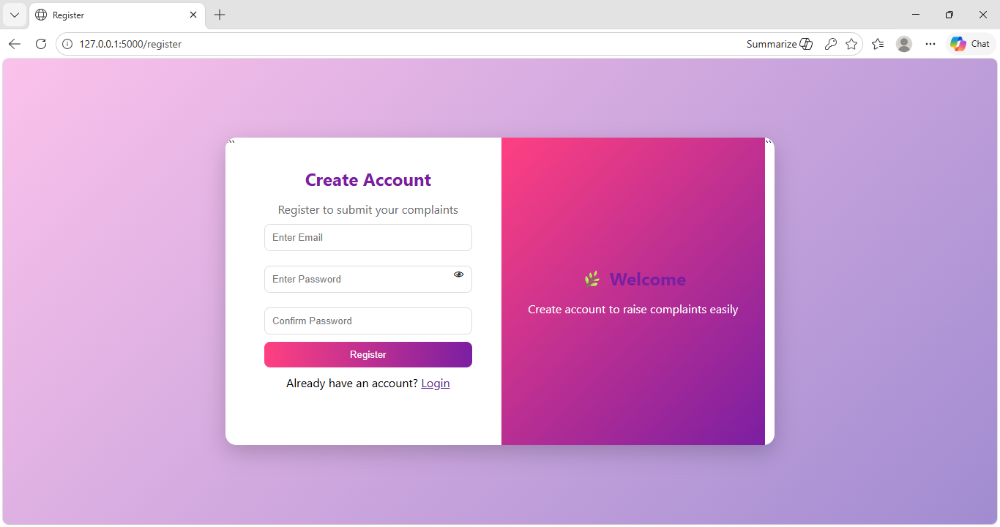
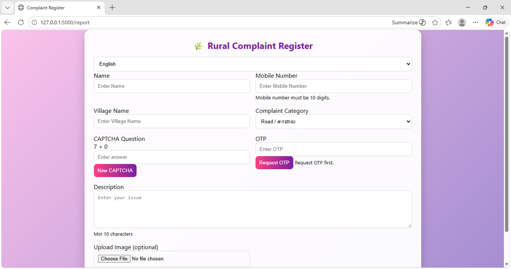
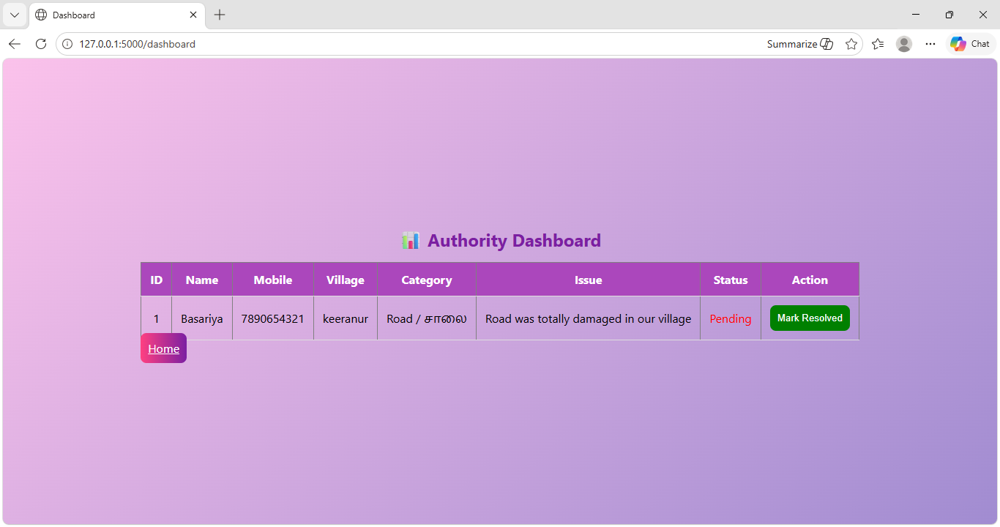
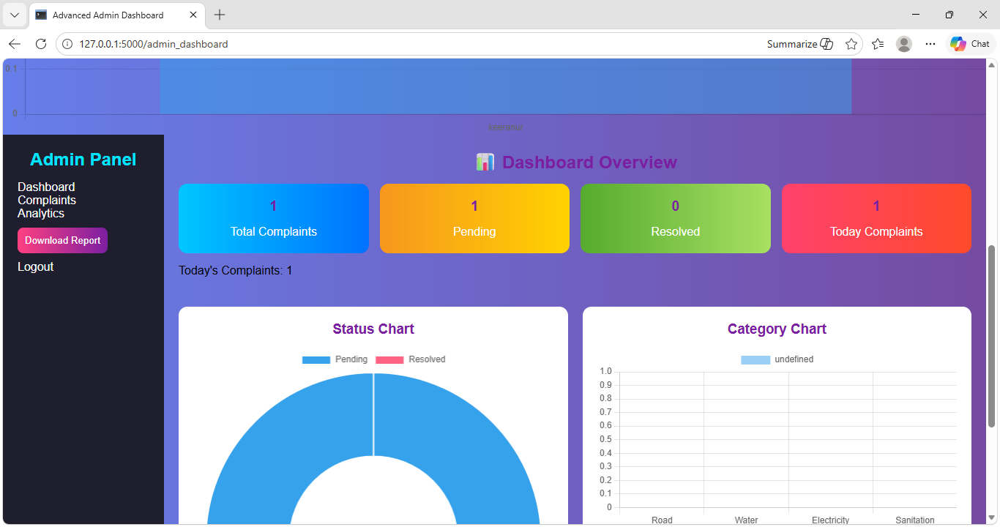

# 🌿 Smart Rural Complaint Management System

## 📖 About the Project

The Smart Rural Complaint Management System is a web-based application developed to help citizens register complaints easily and enable authorities to manage and resolve them efficiently.

The system provides a secure complaint registration process, complaint tracking, and an interactive admin dashboard with analytics and chart-based visualization.

## ✨ Features

- 🔐 Secure Login System
- 👤 User Registration
- 📝 Complaint Registration
- 📱 Mobile Number Validation
- 🌐 English & Tamil Language Support
- 🛡 CAPTCHA Verification
- 📊 Admin Dashboard with Charts
- 📍 Village-wise Complaint Analytics
- 📅 Daily Complaint Tracking
- 📤 Export Complaints as CSV
- ✅ Complaint Status Management (Pending / Resolved)
- 🚪 Logout Functionality

## 💻 Technologies Used

- Python
- Flask
- HTML5
- CSS3
- JavaScript
- SQLite
- Chart.js

## 📂 Project Structure

```
Rural_Pro
│
├── static
│   ├── images
│   ├── uploads
│   └── style.css
│
├── templates
│   ├── login.html
│   ├── register.html
│   ├── report.html
│   ├── dashboard.html
│   └── admin_dashboard.html
│
├── app.py
├── requirements.txt
├── README.md
└── .gitignore
```

## 📷 Screenshots

### Login Page



### Register Page



### Complaint Registration



### User Dashboard



### Admin Dashboard



## ⚙ Installation

1. Clone the repository

```
git clone https://github.com/yourusername/Rural_Pro.git
```

2. Open the project folder

3. Install dependencies

```
pip install -r requirements.txt
```

4. Run the project

```
python app.py
```

5. Open your browser

```
http://127.0.0.1:5000
```

## 🚀 Future Enhancements

- Email Verification
- SMS OTP Integration
- Complaint Image Storage
- Google Maps Integration
- AI-based Complaint Categorization
- Notification System
- PDF Report Generation
- Mobile Application

## 👩‍💻 Developer

**Rabiyathul Basariya**

Second Year Computer Science Engineering Student

Passionate about Web Development and Problem Solving.